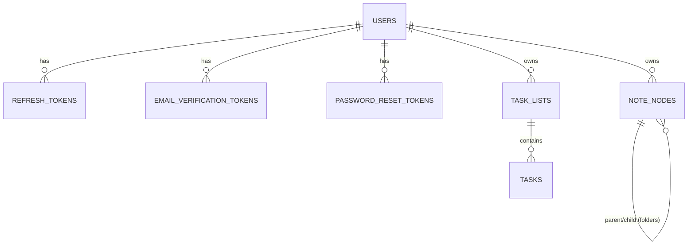

# Database — NoNotion

PostgreSQL 16 schema with pgvector extension for NoNotion. Migrations are Flyway-compatible (`V*` prefix).

## Structure

```
database/
├── README.md
├── docker-compose.yml          # PostgreSQL + pgvector container
├── migrations/                 # Flyway migrations (applied in order)
│   ├── V01_create_enums.sql    # Enums: priority, task_status, notes_node_type
│   ├── V02_create_schema.sql   # Core tables: users, tokens, task_lists, tasks, note_nodes
│   ├── V03_add_indexes.sql     # Performance + uniqueness indexes
│   ├── V04_add_capacity_trigger.sql  # Guard: max tasks per list (100)
│   └── V05_validate_note_node_trigger.sql  # Note node validation trigger (folders/notes hierarchy)
├── seeds/
│   └── V05_seed_data.sql       # Demo data (optional)
└── diagrams/
    └── mer_diagram.html        # Interactive ER diagram (Mermaid)
```

## Modeled Modules

| Module | Tables |
|--------|--------|
| **auth** | `users`, `refresh_tokens`, `email_verification_tokens`, `password_reset_tokens` |
| **tasks** | `task_lists`, `tasks` |
| **notes** | `note_nodes` (folders + notes with hierarchy) |

See [`docs/models.md`](../docs/models.md) for field-level data model and design decisions.

## Quick Start with Docker

```bash
cd database
docker-compose up -d
```

- Host: `localhost:5433`
- Database: `nonotion`
- User: `nonotion`
- Password: `nonotion`
- pgvector extension: **enabled**

Migrations run automatically on first container init (mounted to `/docker-entrypoint-initdb.d/`).

## Manual Migration (psql)

```bash
# Create database first
createdb -U postgres -h localhost -p 5433 nonotion

# Enable pgvector
psql -U nonotion -d nonotion -h localhost -p 5433 -c "CREATE EXTENSION IF NOT EXISTS vector;"

# Run migrations in order
psql -U nonotion -d nonotion -h localhost -p 5433 -f migrations/V01_create_enums.sql
psql -U nonotion -d nonotion -h localhost -p 5433 -f migrations/V02_create_schema.sql
psql -U nonotion -d nonotion -h localhost -p 5433 -f migrations/V03_add_indexes.sql
psql -U nonotion -d nonotion -h localhost -p 5433 -f migrations/V04_add_capacity_trigger.sql
psql -U nonotion -d nonotion -h localhost -p 5433 -f migrations/V05_validate_note_node_trigger.sql

# Optional: seed data
psql -U nonotion -d nonotion -h localhost -p 5433 -f seeds/V05_seed_data.sql
```

## Flyway Integration (Backend)

Migrations are mirrored in `backend/src/main/resources/db/migration/` and run automatically on Spring Boot startup:

```properties
flyway.enabled=true
flyway.locations=classpath:db/migration
flyway.schemas=public
flyway.user=nonotion
flyway.password=nonotion
```

**Never use `spring.jpa.hibernate.ddl-auto=update` in production.** Always version schema via Flyway.

## Schema Overview

### Enums (V01)

```sql
priority: LOW, MEDIUM, HIGH
task_status: TODO, IN_PROGRESS, DONE, DELETED
notes_node_type: FOLDER, NOTE
```

### Core Tables (V02)

| Table | Purpose | Key Columns |
|-------|---------|-------------|
| `users` | Authenticated users | `id` (BIGSERIAL), `email` (unique), `password_hash`, `display_name`, `email_verified`, `created_at`, `updated_at` |
| `refresh_tokens` | JWT refresh tokens | `id`, `user_id`, `token_hash`, `expires_at`, `created_at` |
| `email_verification_tokens` | Email verification | `id`, `user_id`, `token_hash`, `expires_at`, `created_at` |
| `password_reset_tokens` | Password reset | `id`, `user_id`, `token_hash`, `expires_at`, `used_at`, `created_at` |
| `task_lists` | User task lists | `id`, `user_id`, `name`, `color`, `sort_order`, `created_at`, `deleted_at` |
| `tasks` | Tasks within lists | `id`, `user_id`, `list_id`, `title`, `description`, `priority`, `due_date`, `status`, `created_at`, `updated_at`, `deleted_at` |
| `note_nodes` | Notes & folders (hierarchy) | `id`, `user_id`, `parent_id`, `type(FOLDER|NOTE)`, `title`, `content`, `sort_order`, `created_at`, `updated_at`, `deleted_at` |

### Indexes (V03)

- Unique: `users.email`, `refresh_tokens.token_hash`, `email_verification_tokens.token_hash`, `password_reset_tokens.token_hash`
- FK indexes: all foreign keys indexed for join performance
- Composite: `tasks(list_id, position)` for ordered fetching (if position column added)
- Partial: `tasks WHERE status != 'DELETED'` for active task queries
- `note_nodes(user_id, parent_id)` for folder tree queries

### Triggers (V04, V05)

- **Capacity guard** (`V04`): Prevents inserting tasks beyond `task_lists.capacity` (default 100) — *note: capacity column to be added*
- **Note node validation** (`V05`): Validates note hierarchy — parent must be FOLDER, same user, no cycles, FOLDER nodes have no content

## ER Diagram

Open `diagrams/mer_diagram.html` in a browser for interactive Mermaid diagram.



## Connecting

### psql

```bash
psql -U nonotion -d nonotion -h localhost -p 5433
```

### DBeaver / DataGrip / pgAdmin

- Host: `localhost`
- Port: `5433`
- Database: `nonotion`
- User: `nonotion`
- Password: `nonotion`
- SSL: `disable` (local dev)

### Backend (Spring Boot)

```properties
spring.datasource.url=jdbc:postgresql://localhost:5433/nonotion
spring.datasource.username=nonotion
spring.datasource.password=nonotion
```

## pgvector (AI Embeddings)

Extension enabled in `docker-compose.yml` init. For future AI module:

```sql
-- Embeddings table (planned)
CREATE TABLE embeddings (
    id UUID PRIMARY KEY DEFAULT gen_random_uuid(),
    user_id BIGINT NOT NULL REFERENCES users(id) ON DELETE CASCADE,
    source_type VARCHAR(50) NOT NULL,  -- 'note', 'task', 'project'
    source_id BIGINT NOT NULL,
    content_text TEXT NOT NULL,
    embedding VECTOR(1536),            -- dimension depends on model
    created_at TIMESTAMPTZ DEFAULT NOW()
);

-- HNSW index for semantic search
CREATE INDEX ON embeddings USING hnsw (embedding vector_cosine_ops);
```

## Backup / Restore

```bash
# Backup
pg_dump -U nonotion -h localhost -p 5433 nonotion > backup.sql

# Restore
psql -U nonotion -d nonotion -h localhost -p 5433 < backup.sql
```

## Resetting Database

```bash
docker-compose down -v   # removes volume (data loss!)
docker-compose up -d     # fresh start with migrations
```

## Conventions

- **Naming**: snake_case for tables/columns, plural table names
- **PKs**: BIGSERIAL (auto-increment) for current tables; UUID planned for embeddings
- **Timestamps**: `TIMESTAMPTZ` with `DEFAULT NOW()`
- **Soft deletes**: `deleted_at` column on business tables (tasks, task_lists, note_nodes)
- **Multi-tenancy**: Row-level via `user_id` on all business tables
- **Migrations**: Irreversible (`V*`), never modify applied migrations — create new `V*` file

## Related

- Backend config: [`../backend/README.md`](../backend/README.md#database)
- Data model docs: [`../docs/models.md`](../docs/models.md)
- Project architecture: [`../docs/README.md`](../docs/README.md)